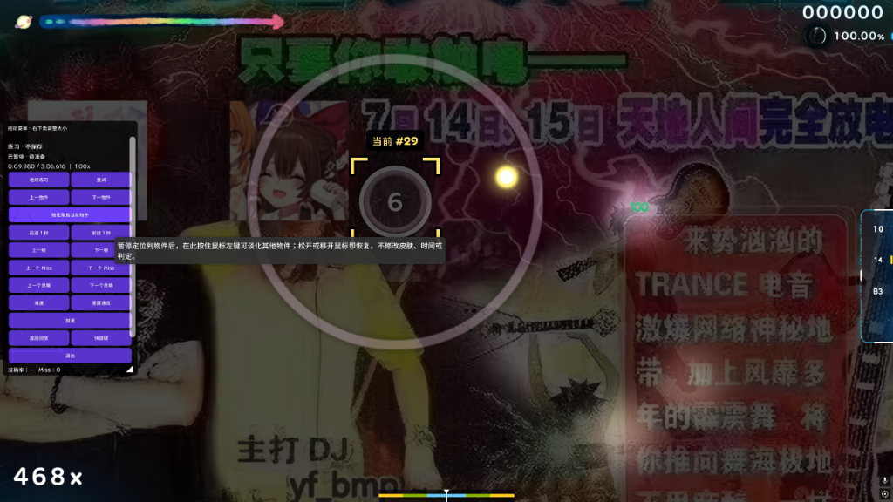

<div align="center">

# osu! Replay Practice

**基于 osu!lazer 的回放接管与片段强化练习工具**  
*Replay and Autoplay takeover practice for osu!standard*

[](https://github.com/post7794/osu-replay-practice)
[](https://github.com/post7794/osu-replay-practice/releases)
[](https://dotnet.microsoft.com/)
[](LICENCE)
[](#界面语言)
[](https://github.com/post7794/osu-replay-practice)

<br/>

[下载测试版](https://github.com/post7794/osu-replay-practice/releases) • [功能特性](#功能特性) • [快捷键速查](#默认快捷键) • [曲库同步](#官方-osulazer-曲库双向同步) • [构建指南](#从源码构建) • [English Summary](#english-summary)

<br/>

<a href="assets/replay-practice-preview.png">
  
</a>

<p align="center">
  <em>练习模式实机界面：金色四角定位框、按住聚焦当前物件与自适应控制边栏</em>
</p>

</div>

<br/>

> [!IMPORTANT]
> 本项目为基于 [ppy/osu](https://github.com/ppy/osu) 的非官方实验分支，专注于 **osu!standard**。练习模式运行于独立内存沙盒，**严格禁止提交成绩、不污染正常数据库、不覆盖原回放**；普通打图、账号登录与常规曲库不受影响。

---

## 功能特性

- **无缝接管与 3 秒冻结倒计时**：观看回放时按 `Ctrl+Enter` 原地进入练习。倒计时 3 秒期间谱面原地冻结，不消耗谱面时间、不发生提前误判，预留光标就位时间；`Ctrl+Shift+Enter` 瞬时重试。
- **Autoplay（AT）自动基线**：选歌界面直接按 `Ctrl+Enter` 启动 Autoplay，跳转到目标段落后即可接管转为真实输入，无需自备回放。
- **金色四角定位与「按住聚焦」**：按 `A` / `D` 切换物件时显示金色四角定位框与绝对序号（如 `#29`）；在密集重叠段长按侧栏“按住聚焦当前物件”可临时淡化其余物件，松手即恢复。
- **原回放失误导航**：后台分析原回放判定链，按 `Shift+N` / `N` 跳转断连 Miss，按 `Shift+M` / `M` 跳转漏连击（如丢滑条尾），直达失误物件刚出现时刻。
- **自适应浮动边栏**：可拖拽缩放并自动吸附边框，严格限制在 Playfield 外侧空白区，跨中线自动切换侧边，绝不遮挡打击圈。
- **官方 osu!lazer 曲库双向同步**：在“设置 → 维护”中直连官方 Realm 数据库（`client.realm` + `files`），原始文件逐字节同步，回放按 SHA256 智能去重，每次写回前自动全量快照备份。
- **原生中英双语**：接入官方本地化架构，跟随游戏语言设置实时切换，无需重启。

---

## 快速上手

### 1. 下载与运行
从 [Releases](https://github.com/post7794/osu-replay-practice/releases) 下载 Windows x64 便携测试包，解压后运行 `Start-Replay-Practice.cmd` 或 `osu!.exe`。自带运行时，默认使用独立测试数据目录 `%APPDATA%\osu-replay-practice-test`。

### 2. 开始练习
- **从回放接管**：观看回放时按 `Ctrl+Enter`，3 秒倒计时后开始练习。
- **从 Autoplay 接管**：选歌界面按 `Ctrl+Enter` 启动 Autoplay，定位到目标位置后再次按 `Ctrl+Enter` 接管。

---

## 默认快捷键

| 分类 | 操作 | 默认快捷键 | 说明 |
| :--- | :--- | :---: | :--- |
| **接管与控制** | 接管回放 | `Ctrl+Enter` | 播放中或暂停时均可触发；Autoplay 亦适用 |
| | 暂停 / 继续 | `Space` / 鼠标中键 | 准备倒计时或手动练习阶段均可暂停 |
| | 极速重试 | `Ctrl+Shift+Enter` | 回到练习起点并重开 3 秒倒计时 |
| | 返回原回放 | `Ctrl+Backspace` | 返回原回放观看并在练习起点暂停 |
| | 直接退出 | `Ctrl+Shift+Backspace` | 退出练习并返回选歌界面 |
| **定位与失误** | 上一个 / 下一个物件 | `A` / `D` | 跳至物件刚出现淡入时刻，显示金色瞄准框 |
| | 上一个 / 下一个 Miss | `Shift+N` / `N` | 查找原回放中导致断连的失误物件 |
| | 上一个 / 下一个漏连击 | `Shift+M` / `M` | 查找原回放中不断连但少加 Combo 的判定（如丢滑条尾） |
| **时间与速度** | 后退 / 前进一秒 | `Q` / `E` | 快退 / 快进 1000ms 谱面时间 |
| | 逐帧后退 / 前进 | `,` / `.` | 按真实回放帧单帧微调 |
| | 减速 / 加速 / 重置 | `S` / `W` / `F` | 以 ±0.05x 步进在 0.05x ~ 2.00x 间调节速度 |

*快捷键可在控制面板底部的“快捷键”按钮或官方设置（Replay 分组）中修改。*

---

## 官方 osu!lazer 曲库双向同步

想要直接使用官方 lazer 的曲库和已保存回放，无需手动复制文件：
1. **完全关闭官方 osu!lazer**（避免数据库文件锁冲突）。
2. 打开本改版，进入 **设置 → 维护 → 官方 osu!lazer 曲库 / 回放双向同步**。
3. 点击“自动检测官方 lazer 数据目录”（默认检测 `%APPDATA%\osu`），启用“双向同步”。
4. 每次写回前均会自动备份官方数据库；详细说明见 [LAZER_SYNC.md](LAZER_SYNC.md)。

---

## 从源码构建

环境要求：PowerShell 7 (`pwsh`) 与相容的 .NET 10 SDK。

```powershell
pwsh -NoProfile -File .\ReplayPractice.ps1 Build    # 编译 Debug
pwsh -NoProfile -File .\ReplayPractice.ps1 Test     # 运行测试 (400+ 项专项回归)
pwsh -NoProfile -File .\ReplayPractice.ps1 Run      # 启动开发隔离客户端 (osu-development-4242)
pwsh -NoProfile -File .\ReplayPractice.ps1 Package  # 打包自包含发布包到 dist/
```

详细技术设计见 [REPLAY_PRACTICE.md](REPLAY_PRACTICE.md)。

---

## 反馈与许可

- 专属功能与测试版问题请提交至 [本仓库 Issues](https://github.com/post7794/osu-replay-practice/issues)，请勿向官方仓库提报。
- 继承上游的 [MIT 许可](LICENCE)；上游项目说明见 [README.upstream.md](README.upstream.md)。

---

## English Summary

**osu! Replay Practice** is an experimental fork of [ppy/osu](https://github.com/ppy/osu) that adds replay and Autoplay takeover practice for **osu!standard**.

- **Takeover & 3s Countdown**: Press `Ctrl+Enter` while watching a replay to freeze the frame for a 3-second preparation countdown before taking control. Instant retry via `Ctrl+Shift+Enter`.
- **Autoplay Baseline**: Press `Ctrl+Enter` in song select to start Autoplay, seek to any pattern, and take over into real manual input.
- **Aim Brackets & Hold-to-Focus**: Navigate objects (`A` / `D`) with gold brackets and index markers (`#29`). Hold the focus button to temporarily dim surrounding objects in dense patterns.
- **Failure Navigation**: Quickly jump to previous/next combo breaks (`Shift+N` / `N`) or dropped slider tails (`Shift+M` / `M`) indexed directly from original replay frames.
- **Floating HUD**: Draggable, resizable sidebar constrained strictly outside the playfield margins.
- **Official Lazer Sync**: Bidirectionally sync beatmaps and replays directly with your official osu!lazer Realm library (`client.realm` + `files`) with automatic backups.
- **Safe Sandbox**: Isolated test data directory; practice scores never submit to leaderboards or alter local databases.

Download the Windows x64 portable package from [Releases](https://github.com/post7794/osu-replay-practice/releases).
